# Sprout: Design Review & Rive Plan

*Reviewed 25 Sep 2026 on Expo web (`localhost:8081`), driven by Playwright/Chromium at 393×852 @3x (iPhone 15, touch). Small-screen checks ran at 375×667 @3x (iPhone SE). I read every screen, component and state module in `src/` before exploring. States that are hard to reach by clicking (slips, shields, recap day, evening, zero habits, rest day, 12 habits) were set up by writing the `sprout:v1` JSON into localStorage and faking the clock with `page.clock` in the test browser only. No source files were changed.*

**Labels used below**
- **Severity:** `Critical` breaks a core promise or the reward loop · `Major` clearly hurts quality or trust · `Minor` noticeable rough edge · `Polish` separates good from premium.
- **Type:** `Real` a bug or design flaw that also ships on device · `Web` an Expo-web artifact only · `Verify` probably web-only, but confirm on a device.

---

## 1. Summary

**Verdict.** Sprout has a genuinely good skeleton. The tokens are right, the ledge system exists, Pip is charming and cleanly built from parts, and the copy is mostly warm and specific. But it does not yet deliver the one thing the product is sold on: **completing something doesn't feel rewarding, and Pip doesn't visibly care.** A check-off is a small green circle, 18 confetti specks that travel about 70px, a 0.7-second smile, and a strikethrough that says "cancelled" rather than "you did it". The biggest moment of the day, finishing the last habit, is skipped entirely: the screen hard-cuts to the Perfect Day view before the tick even draws. Worse, the logic breaks the product's own rules in the most visible place. Weekly habits are counted as "due" every day, so a perfect day requires going to the gym daily, and the Progress grid paints every non-gym day as **Missed**. Contrast fails across the board: white text on the primary green is 2.2:1, and the tertiary grey is 2.0:1. It looks like a well-executed Figma file; it doesn't yet *feel* like Duolingo. Most of that gap is motion, feedback and three or four logic fixes, not a redesign.

### Top 10 issues, ranked by impact

| # | Issue | Severity | Type |
|---|---|---|---|
| 1 | **Weekly habits count as due every day.** Gym at 4×/week sits in the daily badge (`1/4`) until the week's target is met, so a "perfect day" needs a gym session daily. The Progress grid and habit calendar paint weekly off-days as **Missed**. Breaks the product rules "judged by the week" and "badge counts only habits due today". | Critical | Real |
| 2 | **The last check-off of the day is swallowed.** When the final habit lands, `Today` swaps to `<PerfectDay>` in the same render: no tick draw, no confetti, no flame flare. The celebration then **replays on every visit and reload**, so it quickly becomes wallpaper. | Critical | Real |
| 3 | **Checking off is under-rewarding.** Confetti spans roughly 40–74px for 800ms. The done state is a grey struck-through title (to-do-list "cancelled" semantics). There's no streak +1 moment beyond a 0.46s digit flip, Pip cheers for 700ms, and nothing marks progress toward "all done". | Critical | Real |
| 4 | **Pip doesn't reflect the day.** Pip looks identical at 1/4 and 3/4. The "droopy" face uses angled brows that read as angry or judgmental (evening, slips). Tapping Pip does nothing. Mood changes are instant part-swaps. On the slip sheet, the emotional moment, Pip is hidden behind the scrim. | Major | Real |
| 5 | **Contrast failures on core UI.** White on `#58C27D` is 2.23:1 on every primary button, the FAB and done checks. Tertiary `#B5B1A8` is 2.0:1 (hint text, chevrons, placeholders). Nav labels are 2.95:1. Detail headers put white on tangerine, sky and teal at 2.0–2.6:1. | Major | Real |
| 6 | **Recap numbers lie.** "**30** habits kept this week" for a user with 5 habits: `kept` sums check-ins, not habits. On a Friday, Progress still offers last week's recap ("Sep 14–20"). The final card says "See you Monday." when viewed on Monday. | Major | Real |
| 7 | **Pause is cosmetic.** `paused` is a flag with no dates, so the streak logic counts the paused period as missed. Resume after two weeks and the streak is gone and a slip sheet fires. The detail screen barely shows the paused state (same header, same "Your best yet ✦"). | Major | Real |
| 8 | **No way to correct history.** Calendar cells aren't tappable and yesterday can't be logged. The slip sheet offers only "Use a shield" or "Start fresh", so a user who *did* read last night but forgot to tap has to spend a shield or lose the streak. Related: "Maybe later" on the notification step saves `reminders: true`, and You then shows Reminders **On**. | Major | Real |
| 9 | **Habits become indistinguishable at scale.** Every new habit defaults to sky blue, the sprout icon and 9 pm, so 12 habits make a wall of identical blue cards. Progress rows are identified by icon only. Names are silently cut at 28 characters, and card titles truncate at around 13 ("No phone in b…"). | Major | Real |
| 10 | **Small-screen breakage.** On iPhone SE the Notify step overflows: "Maybe later" sits at y=684 in a 667pt viewport, inside a non-scrolling `View`. The Rhythm step's floating "Plant it" covers content with no backdrop. The FAB sits over card streaks and settings chevrons. | Major | Real |

Honourable mention: a card's streak number **vanishes** after you check a *different* habit ([30](screenshots/30-bug-streak-number-vanishes-after-other-check.png)). It's a Reanimated `entering` keyframe stuck at frame 0 on web. `Verify` on device, but it's reproducible every time on web.

---

## 2. Screen-by-screen critique

### 2.1 Onboarding: Welcome

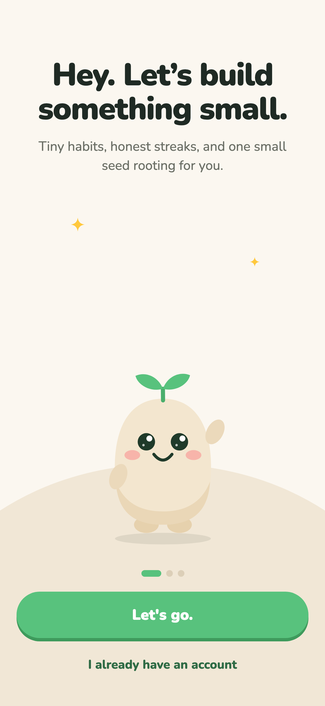 · [pressed](screenshots/02-onboarding-welcome-button-pressed.png) · [SE](screenshots/13-se-welcome.png)

| Issue | Sev | Type | Fix |
|---|---|---|---|
| About 40% of the screen (between the subtitle and Pip) is empty cream with two sparkles. Pip is the product and is pushed to the bottom third. | Major | Real | Centre Pip vertically in the free space at 200→240pt. Move the sparkles into Pip's orbit (±90pt from centre). Or use the space for a 3-beat Pip intro (see Rive §5, "Welcome"). |
| Pip's body `#F3E6CF` sits on the hill `#F1E7D6`: 1.02:1, so the silhouette dissolves into the ground. | Major | Real | Darken the hill to `#EADBC3` or give Pip a 2px `#E6D1AD` rim. Keep the ground shadow at 18% ink, not 10%. |
| The waving right hand floats about 8pt off the body. | Minor | Real | In `ARMS.wave` move the right arm to `[158, 104, 28]` so it overlaps the body edge, or parent it to a shoulder pivot in the Rive rig. |
| Step dots show 3 steps, but onboarding has 4 screens (Welcome, Pick, Rhythm, Notify). Notify has no dots and no back button. | Minor | Real | Either drop the dots from Welcome and show 3 on Pick/Rhythm/Notify, or show 4 everywhere. Add a back arrow to Notify. |
| "I already have an account" opens `window.confirm` and then loads a fake account named **Alex** with 110 days of history. That's a bait-and-switch for someone who really has an account. | Major | Real (dialog is Web) | Rename to "Just looking? Explore a sample garden". Never label it as an account. When sync lands, bring the account link back. |
| Button label uses a straight apostrophe ("Let's go.") while the headline uses a curly one ("Let’s"). | Polish | Real | Use `’` everywhere. |
| Press state works: the face drops 4px and the ledge disappears ([02](screenshots/02-onboarding-welcome-button-pressed.png)). ✅ | | | |

### 2.2 Onboarding: Pick habits

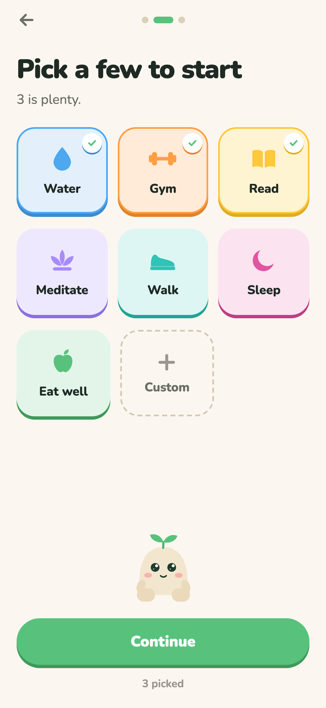 · [zero](screenshots/04-onboarding-pick-zero-disabled.png) · [all](screenshots/05-onboarding-pick-all-plus-custom.png) · [back keeps state](screenshots/09-onboarding-back-to-pick-state-kept.png) · [SE custom only](screenshots/14-se-pick-custom-only.png)

| Issue | Sev | Type | Fix |
|---|---|---|---|
| **Selected and unselected tiles look almost the same.** Both are fully tinted with a ledge; selection adds only a 2.5px border and a 24pt check badge. Compare [03](screenshots/03-onboarding-pick-default-3.png) with [04](screenshots/04-onboarding-pick-zero-disabled.png). | Major | Real | Unselected: white face, `#ECE4D6` ledge, icon at 60% opacity. Selected: tint face, accent ledge, 3px accent border, a check badge that pops, and Pip glances at the tile (Rive `lookAt`). |
| Water, Gym and Read are pre-selected, so a new user may never notice they picked anything. | Minor | Real | Start at 0 picked with "Pick 1–3". Or keep the defaults but show a toast from Pip: "I picked three to start. Swap any." |
| Pip "holds the edge" of a bottom panel that has no visible edge (the panel is `p.bg`), so the peek reads as a floating head with two stray blobs. | Minor | Real | Give the panel a white surface with a 32px top radius and a `#ECE4D6` hairline, or drop the hands. |
| Grid misalignment: `width 31% + flexGrow + maxWidth 32%` makes the last row's tiles (Eat well, Custom) a different width from the rows above. | Minor | Real | Use a fixed 3-column grid: `(393 − 40 − 24) / 3 = 109.67pt` per tile, 12pt gutters. |
| The Custom tile has no ledge (dashed only), so it breaks the depth system. It also defers naming to a sheet that auto-opens 450ms after landing on Home ([12](screenshots/12-home-first-run-custom-sheet-autoopen.png)), which is disorienting. | Minor | Real | Let the name be typed inline on the Rhythm step as its own card. Keep dashed, but add a 4px `#E3D8C4` ledge when selected. |
| "8 picked · maybe start with fewer?" is good copy. ✅ Back navigation keeps picks. ✅ | | | |

### 2.3 Onboarding: Set your rhythm

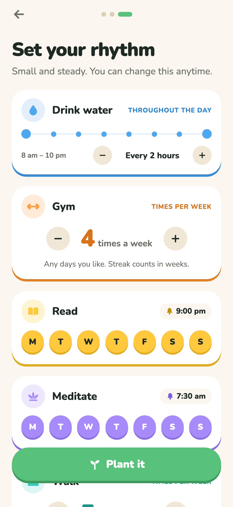 · [bottom](screenshots/08-onboarding-rhythm-bottom.png) · [3 habits](screenshots/10-onboarding-rhythm-3-habits.png)

| Issue | Sev | Type | Fix |
|---|---|---|---|
| "Plant it" floats over the list with no backdrop. Cards scroll visibly underneath, and the next card peeks through the button's gap ([06](screenshots/06-onboarding-rhythm-top.png)). | Major | Real | Put the button in a footer: `p.bg` with a 24pt fade-out gradient above it, and 20pt padding plus the safe-area inset. |
| The reminder time only cycles through 9 hard-coded times by tapping the chip, with no feedback that it's tappable and no "Off" option. Weekly (Gym) and Throughout-the-day habits can't set a time here at all. | Major | Real | Tapping the chip opens the same time stepper as the add sheet (15-min steps), with an "Off" pill. Show the chip on weekly habits too. |
| Day toggles are 36–38pt, below 44pt. | Minor | Real | 40pt visual with `hitSlop` 4, or 44pt on screens ≥390pt wide. |
| Card headers use 11pt caps in accent ink, e.g. sunflower `#C28E0A` on white at 2.9:1. | Minor | Real | Use `#6B6F66` for caps labels. Keep the accent for the icon only. |
| Deselecting the last active weekday silently does nothing (`if (days.some(Boolean))`). | Polish | Real | Wiggle the toggle and show "At least one day". |

### 2.4 Onboarding: Can I nudge you?

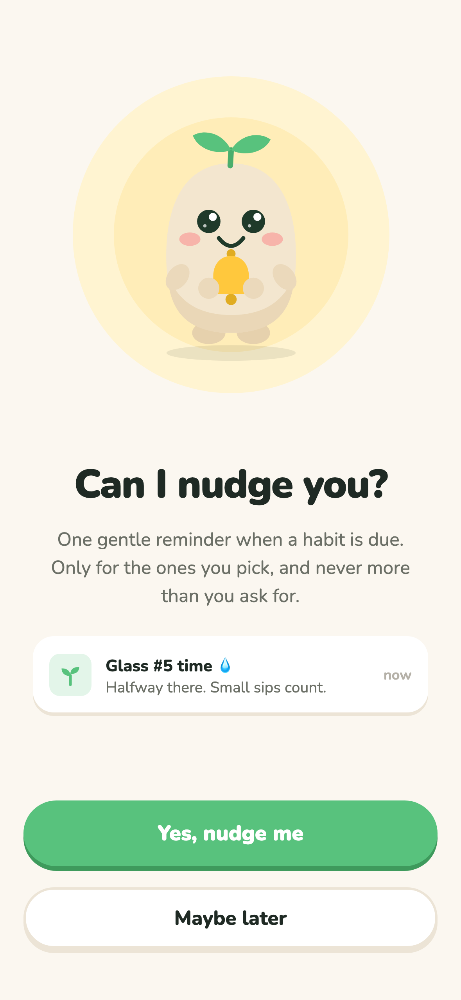 · [SE overflow](screenshots/15-se-custom-only-skips-to-notify.png)

| Issue | Sev | Type | Fix |
|---|---|---|---|
| **iPhone SE: "Maybe later" is off-screen** (y=684 in a 667pt viewport, root is a plain `View`). On device it's unreachable, so the only way forward is "Yes". | Major | Real | Wrap the screen in a `ScrollView`, shrink the Pip halo to 220/160 on heights under 700pt, or drop the preview card on small screens. |
| **"Maybe later" writes `reminders: true`** (`finish(false)` → `setSettings({ reminders: ask ? granted : true })`). You then shows "Reminders · On" though permission was never asked. | Major | Real | `reminders: ask ? granted : false`. On You, show "Off · Turn on" and ask on tap. |
| No back button and no progress dots, unlike every other step. | Minor | Real | Add `OnboardingHeader step={3}` (with 4 dots). |
| Pip's bell "rings" by rotating the whole Pip ±8°, so the body wobbles like it's falling over. | Polish | Real | Rotate only the bell and arm (Rive rig, §5). |

### 2.5 Home / Today

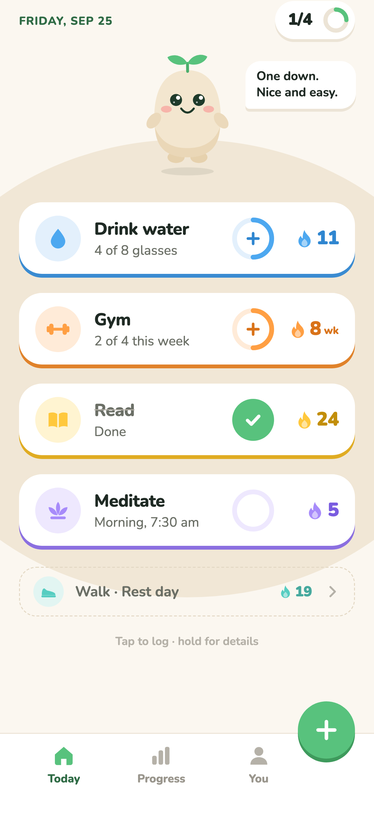 · [after meditate](screenshots/23-home-after-check-meditate.png) · [after gym](screenshots/26-home-after-check-gym.png) · [undo](screenshots/27-home-undo-meditate-no-confirm.png) · [scrolled](screenshots/29-home-scrolled-bottom-rest-row.png) · [SE](screenshots/64-se-home-demo.png)

**Visual hierarchy.** The eye goes to the date and the badge first, then Pip, then the cards. Pip is only 120pt and ends up as decoration in the top-left third, with a bubble whose text wraps to 2–3 lines at 13pt. The streak numbers, which the spec calls "huge and extra bold", are 20pt, the same visual weight as the titles.

| Issue | Sev | Type | Fix |
|---|---|---|---|
| **Badge includes weekly habits** (see Top 1). At midday Friday the badge reads `1/4`, with Gym counted as due although 2 of 4 with 3 days left is perfectly on track. | Critical | Real | In `dueOn`, count a weekly habit only if it was logged today *or* the week is at risk (`need >= daysLeft`, already written as `weekAtRisk` in `nudge.ts`). Otherwise show it in a "This week" section below the dailies with its ring. |
| **Done state reads as cancelled.** Grey `#6B6F66` title with a `#B5B1A8` strikethrough, and the card stays white. | Critical | Real | Keep the title in ink. Change the sub to "Done · 8:05 am" in the accent ink. Fill the card with the accent `tint` (e.g. `#E3F0FC`) and keep the 4px accent ledge. Drop the strikethrough everywhere (Home, Perfect day). |
| **Check-off feedback is too small** ([22](screenshots/22-home-check-meditate-confetti-frame.png)): 18 pieces, 40–74px radius, no gravity, 800ms. The flame flares to 1.3× for 180ms. | Critical | Real | Beats: t=0 card presses and releases with a 1.03 "boop". t=80 tick draws. t=120 burst of 28 pieces at 70–150px with gravity and a 1.1s fade. t=200 flame ignites (Rive, §5) and the streak number rolls up with a +1 chip in the accent. t=250 Pip plays `celebrate`. t=600 the badge ring advances with a spring. |
| **Daily "not done" control** is an empty pale ring (`a.tint`, e.g. `#EEE8FE` on white, 1.2:1). It reads as disabled, and daily habits use a different control from weekly and counter habits (ring with "+"). | Major | Real | 44pt circle with a 3px `#E3D8C4` stroke and a faint 40%-opacity tick ghost. On press, fill with the accent. Keep one "done" style (green check) per the spec. |
| **Accidental toggles.** The whole card toggles, including undo, with no confirmation and no toast ([27](screenshots/27-home-undo-meditate-no-confirm.png)). Tapping a full counter silently *removes* a glass (`n >= t ? t - 1`). | Major | Real | Undo only via the check control, with a 4s snackbar: "Meditate unchecked · Undo". A full counter should do nothing on tap except a wiggle and "8/8 — nice!". Long-press the check to take one back. |
| **Weekly "done today" is struck through** while the sub says "3 of 4 this week", which is contradictory ([26](screenshots/26-home-after-check-gym.png)). | Major | Real | Weekly card after logging today: the ring fills to 3/4 with a check badge on the ring, and the sub reads "Logged today · 3 of 4". Only a met week gets the full done style. |
| **Streak number vanishes** on card A after checking card B ([30](screenshots/30-bug-streak-number-vanishes-after-other-check.png)). The `Animated.View key={streak} entering={flip}` stays in `REA-ENTERING` at opacity 0. | Major | Verify | Replace the keyed remount with a controlled `useSharedValue` roll (translateY −22 → 0) driven by a `useEffect` on `streak`, or render the number in the Rive flame component. |
| **Pip mood doesn't track progress.** `happy` from 1/4 to 3/4 looks identical ([20](screenshots/20-home-demo-midday.png) vs [26](screenshots/26-home-after-check-gym.png)). Tapping Pip does nothing ([28](screenshots/28-home-tap-pip-no-response.png)). | Major | Real | Rive `dayProgress` blend (§5): leaves rise, eyes open wider, and the idle bounce increases with progress. A tap gives a giggle, a leaf wiggle and a random line. |
| **Droopy = angry.** The evening and slip faces have inward-slanted half-lids that read as scowling ([90](screenshots/90-home-evening-dusk.png), [80](screenshots/80-slip-sheet-meditate.png)). This violates "never scolding". | Major | Real | Droopy should be soft: lids flat or tilted outward (sad, not mad), a small "o" or wobbly mouth, and leaves wilting only to 35°. Evening should use `expectant` (looking at the unfinished card), not droopy. |
| **Mood and copy contradict each other.** With a slip, Pip is droopy while the bubble says "One down. Nice and easy." ([80](screenshots/80-slip-sheet-meditate.png)). | Minor | Real | Derive bubble and mood from the same switch. With a slip: "Oh no — want to save it?" |
| Bubble `maxWidth: 116` wraps "Still time for a couple. No rush." to 3 lines ([90](screenshots/90-home-evening-dusk.png)). | Minor | Real | `maxWidth: 168`, 14pt/700. Anchor the tail to Pip's mouth height. |
| The late-night bubble (23:40) still says "Still time for a couple." ([91](screenshots/91-home-late-night-sleepy.png)). | Minor | Real | After 22:30: "Tomorrow’s a fresh one. Sleep well." |
| A due line like "Morning, 7:30 am" still shows at 13:10, after the time has passed. | Minor | Real | Past the reminder time: "Any time today", or "Still open" in the accent. |
| "Tap to log · hold for details" is 12pt at 2.0:1 contrast, and long-press is the *only* route to details from a card. | Major | Real | Add a chevron tap zone to the card title (tap the title to open details, tap the check to log) and delete the hint. |
| Streak "0" with a lit flame on new habits ([60](screenshots/60-home-12-habits-top.png)) reads as a failure indicator on day one. | Minor | Real | Streak 0: grey outline flame and a "New" pill, and the flame ignites on the first check (Rive). |
| The FAB overlaps the last card's streak column mid-scroll ([64](screenshots/64-se-home-demo.png)). Tab items are pushed left (`paddingRight: 70`), so the nav looks off-centre. | Minor | Real | Scroll `paddingBottom: 60 + 76`. Centre the FAB as a raised 4th slot, or float it above the bar at 16pt with a `#FBF7F0` 4pt halo. |
| All-rest day shows a `0/0` badge, a lone dashed row and 70% empty screen ([96](screenshots/96-home-all-rest-day.png)). | Minor | Real | Hide the badge. Show Pip `sleepy` with a hammock or tea prop, the line "Rest day. Enjoy it.", and a "Back tomorrow: Long run" card. |
| The date header is 12pt caps green, fine, but the hill is an ellipse that ends mid-list at 12 habits ([60](screenshots/60-home-12-habits-top.png)). | Polish | Real | Pin the hill to the Pip area (fixed 260pt tall) so it doesn't slice through cards. |
| The Expo dev-tools "⚡" button overlaps the tab bar ([25](screenshots/25-home-gym-weekly-check-frame.png)). | — | Web | Ignore. |

### 2.6 Check-off moment & Perfect day

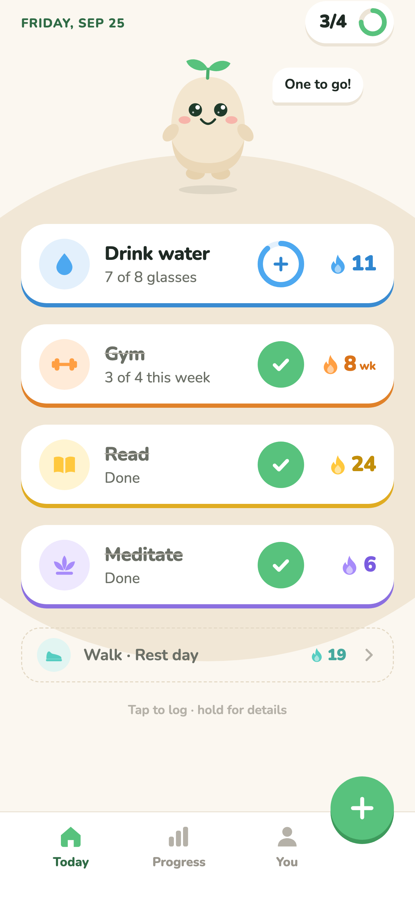 · [transition](screenshots/32-perfect-day-transition-frame.png) · [perfect](screenshots/33-perfect-day.png) · [replay](screenshots/35-perfect-day-replays-on-every-visit.png) · [untap](screenshots/36-untap-from-perfect-day-list.png)

| Issue | Sev | Type | Fix |
|---|---|---|---|
| **The final check has no moment of its own.** The frame after the tap is already the gold wash with a half-transparent Pip ([32](screenshots/32-perfect-day-transition-frame.png)). The last card's tick, confetti and badge fill never render. | Critical | Real | Sequence: final card check (full beat, about 900ms), then the badge morphs to gold (300ms), then Pip hops up (`perfect` trigger), then the gold wash wipes up from the hill (400ms), then the "Perfect day" title types in. Delay the `perfect` branch by ~1.1s via state (`celebratingUntil`). |
| **Replays on every visit**, reload and tab switch ([35](screenshots/35-perfect-day-replays-on-every-visit.png)). | Major | Real | Persist `celebrated: DayKey[]`. Revisits show the static finished state (Pip `proud`, no hop). |
| Confetti is static (`Scatter`), which looks like a printed pattern. | Major | Real | A one-shot Rive or particle burst (§5), then 6–8 slow-drifting pieces as ambience. |
| Pip is `cheering` on the perfect screen, but the spec lists **Proud**, and `proud` is never used on Home. | Minor | Real | Use cheering while the burst plays, then settle to proud (trophy prop, 2s later). |
| The list uses strikethrough again, grey `#8C887F`, and a hard-coded resting color. | Minor | Real | Same done styling as §2.5. Use tokens only. |
| "10 perfect days this month" is 16pt/600 grey. The one number that should feel huge is body text. | Major | Real | "10" at 56pt/900 in `GOLD.ink` with "perfect days in September" under it at 15pt. Add a mini 7-day strip of gold dots. |
| Untapping from the perfect list works, but drops you back to Home with no transition ([36](screenshots/36-untap-from-perfect-day-list.png)). | Minor | Real | Reverse wipe (300ms), then Pip plays "oops" and returns to happy. |

### 2.7 Add habit sheet (and Edit)

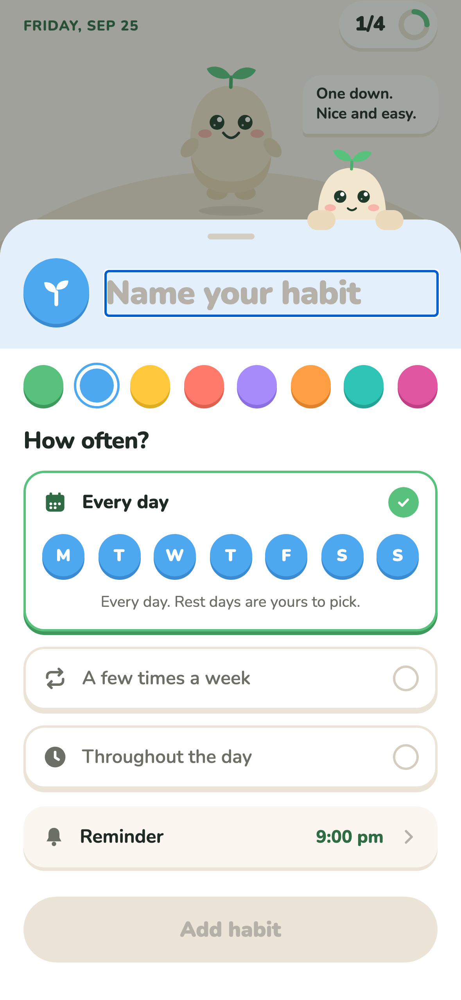 · [28-char cut](screenshots/52-add-sheet-long-name-truncated-28.png) · [emoji+weekly](screenshots/53-add-sheet-emoji-coral-weekly.png) · [throughout](screenshots/54-add-sheet-throughout-day.png) · [0 days](screenshots/55-add-sheet-zero-days-selected.png) · [reminder](screenshots/56-add-sheet-reminder-stepper.png) · [edit](screenshots/49-edit-sheet-water.png) · [SE](screenshots/62-se-add-sheet.png) · colours: [leaf](screenshots/57-add-sheet-color-leaf-green.png) [sky](screenshots/57-add-sheet-color-sky-blue.png) [sunflower](screenshots/57-add-sheet-color-sunflower.png) [lavender](screenshots/57-add-sheet-color-lavender.png) [tangerine](screenshots/57-add-sheet-color-tangerine.png) [teal](screenshots/57-add-sheet-color-teal.png) [berry](screenshots/57-add-sheet-color-berry.png)

| Issue | Sev | Type | Fix |
|---|---|---|---|
| **The name is silently cut at 28 characters** (`maxLength={28}`). "Practice Spanish vocabulary with flashcards daily" became "Practice Spanish vocabulary " with a trailing space ([52](screenshots/52-add-sheet-long-name-truncated-28.png)). | Major | Real | Allow 40. Show a counter from 24 ("32/40"). Shrink the input font from 28 to 22pt past 18 characters. Trim on save (already done). |
| **Every new habit defaults to sky blue + sprout icon + 9 pm** ([60](screenshots/60-home-12-habits-top.png)). | Major | Real | Default the colour to the first `SWATCH_ORDER` accent not in use and the icon to `guessIcon` or a rotating set. Default the reminder to "Off" for custom habits. |
| The icon can only be changed by tapping the icon repeatedly to cycle through 11 icons, with no picker and no hint. | Major | Real | Tapping the icon opens a 4×3 grid popover. Show a tiny pencil badge on the icon. |
| The option label "**Every day**" stays even with 1 day picked ("1 day a week"). | Minor | Real | Label "On certain days", with the sub-line summarising "Every day" or "Mon, Wed, Fri". |
| The reminder moves in 30-minute steps from 9 pm: reaching 7 am takes 28 taps. | Major | Real | Native time picker (`@expo/ui` DateTimePicker is already a dependency), or a wheel with 15-minute steps. |
| "Throughout the day" is fixed to 8 am–10 pm with no way to change it. Unit is "glasses" only if the icon is a drop, "times" otherwise ("Stretch · 0 of 8 times"). | Minor | Real | Two small steppers for the window. A unit field with suggestions (glasses, pages, sets). |
| **Sheet height jumps** as options expand, so Pip's peek slides over the home bubble behind ([56](screenshots/56-add-sheet-reminder-stepper.png)). | Minor | Real | Fixed height of `min(720, winH − insets.top − 24)` with internal scroll. |
| No title, no explicit cancel, and the draft is discarded on scrim tap ([58](screenshots/58-add-sheet-reopen-after-cancel-draft-lost.png)). | Minor | Real | "New habit" / "Edit habit" title at 13pt caps. "Cancel" on the left. If the name is non-empty, keep the draft for 10 minutes. |
| The Edit sheet has no Archive or Delete. Those live as 14pt grey text links on the detail screen. | Minor | Real | Add a "Archive habit" row at the bottom of the Edit sheet in coral `#D9533F`. |
| Swatches are 34pt and toggles 36pt (under 44). | Minor | Real | Swatches 36pt with a 44pt hit area: `(353 − 7×9)/8 ≈ 36`. |
| A blue focus rectangle surrounds the name input. | — | Web | `outlineWidth: 0` isn't applied through RN-web. Ignore on native, or set `outlineStyle: 'none'` for web. |
| Colour-tinted header, emoji support and the disabled state are good. ✅ | | | |

### 2.8 Habit detail (daily, weekly, counter)

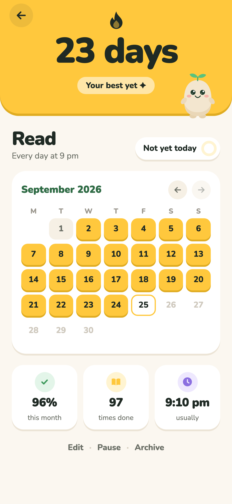 · [prev month](screenshots/42-detail-read-previous-month.png) · [gym](screenshots/43-detail-gym-weekly.png) · [paused](screenshots/45-detail-gym-paused.png) · [water](screenshots/48-detail-water-counter.png) · [SE gym](screenshots/112-se-detail-gym.png) · [dark](screenshots/98-dark-detail-read.png)

| Issue | Sev | Type | Fix |
|---|---|---|---|
| **White on accent headers fails contrast.** "8 weeks" white on tangerine is 2.04:1, sky 2.57, teal 2.17, coral 2.55. The pill "Your best yet ✦" is white on the edge colour (2.8:1). | Major | Real | Use ink `#1F2A24` on every accent except berry (ink on tangerine 7.3, sky 5.8, teal 6.9, lavender 5.5, coral 5.8). The sunflower path already does this, so extend `LIGHT_ACCENTS` to all but berry. |
| **Calendar is read-only.** You can't backfill yesterday, fix a mistaken tap, or see partial counter days (5/8 glasses shows the same as missed, [48](screenshots/48-detail-water-counter.png)). | Major | Real | Tap a past cell (up to 7 days back): popover with "Mark done" or "Undo". Counter days get a partial fill (like the Progress week cell). |
| **Weekly calendar shows non-session days as missed-looking beige** ([43](screenshots/43-detail-gym-weekly.png)). The first row's pill counts Aug 31, which isn't shown (3 cells plus a "4/4 ✓" pill). | Major | Real | Weekly habits: non-session days are blank (no fill). Show leading and trailing days of adjacent months at 40% so the counts add up. |
| **Paused looks identical to active** except for the sub-line "Paused" ([45](screenshots/45-detail-gym-paused.png)). | Major | Real | Desaturated header (`mix(base, #F6F0E5, .35)`), a "Paused since Sep 25" pill instead of best-streak, Pip `sleepy`, and a big "Resume" primary button. |
| Edit · Pause · Archive are 14pt grey text links, about 19pt tall with hitSlop 8 (≈35pt). Archive is destructive with only a `window.confirm`. | Major | Real (confirm is Web) | A secondary button row: [Edit] [Pause]. Archive moves into the Edit sheet (see §2.7). |
| Back button 40pt, month arrows 32pt. | Minor | Real | Both at least 44pt hit area (`hitSlop` 6 on arrows). |
| Future cells `#CFC9BE` on white are 1.65:1. | Minor | Real | `#A8A398` (2.5:1 is fine for inactive dates) and weight 700. |
| Pip (80pt) peeks from the header corner and is always `happy`, whatever the streak state. | Polish | Real | Pip reacts: best ever → `proud` with trophy; 0 → `expectant`; paused → `sleepy`. |
| "Your best yet ✦" shows on day 1 for any streak ≥ best, and "Just planted 🌱" only when best = 0. Both are fine, but the milestone moment (7, 30, 100) isn't marked anywhere. | Polish | Real | Milestone chip plus a one-time flame evolution (§5). |
| The 60pt streak number is the right scale. ✅ Weekly result pills are a smart touch. ✅ | | | |

### 2.9 Streak slipped / Shield

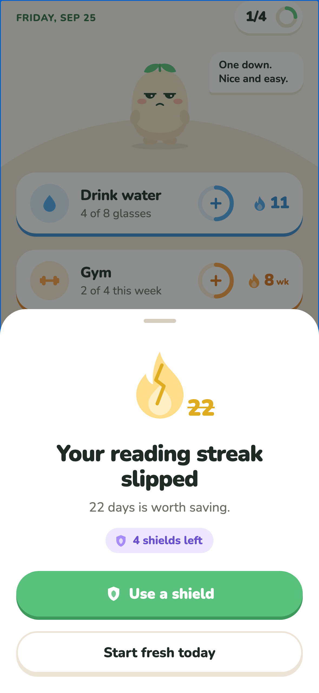 · [shield frame](screenshots/81-shield-used-frame.png) · [saved](screenshots/82-shield-used-streak-saved.png) · [second slip](screenshots/83-after-shield-second-slip-read.png) · [no shields](screenshots/85-slip-sheet-no-shields.png) · [weekly slip](screenshots/86-home-weekly-gym-missed-last-week.png)

| Issue | Sev | Type | Fix |
|---|---|---|---|
| **Pip is absent from the slip sheet** and droopy (scowling) behind the scrim. The emotional core of "missing matters but isn't scolding" is carried by an icon. | Major | Real | Pip (110pt) peeks over the sheet edge like the add sheet, in a soft sad pose, holding the cracked flame. On "Use a shield", Pip catches the shield and plays `shieldSaved` (§5). |
| **Shield use is the right idea but under-animated.** The shield zooms in (360ms) and the glow pulses once. There's no "repair" beat: the crack doesn't heal and the number doesn't un-strike. | Major | Real | Rive `shield.riv` (§5): crack glows, shield slams in, crack stitches closed, flame re-ignites, number counts 22→22 with the strike wiping off, then +1 "today makes it 23" chip. |
| Flame and number layout flips between sheets: the number is right-bottom on "slipped" and left-bottom on "saved". | Minor | Real | Keep the number in one place (below the flame, 40pt/900) so the before and after read as the same object. |
| Two slips back-to-back: after "Back to today" a second sheet opens immediately ([83](screenshots/83-after-shield-second-slip-read.png)). | Minor | Real | One sheet listing all slipped habits with a checkbox each. "Use 2 shields" or "Start fresh". |
| "No shields yet" after spending four is wrong copy ([85](screenshots/85-slip-sheet-no-shields.png)). No "I actually did it" path exists. | Major | Real | "No shields left · next in 13 days". Add a tertiary action: "I did it — log yesterday" (only for the most recent period, once per week). |
| For weekly habits the card shows `0 wk` behind the sheet before the user decides ([86](screenshots/86-home-weekly-gym-missed-last-week.png)). | Minor | Real | While a slip is pending, show the old streak with a cracked flame, not 0. |
| Copy is excellent: "Your reading streak slipped · 22 days is worth saving." ✅ | | | |

### 2.10 Progress

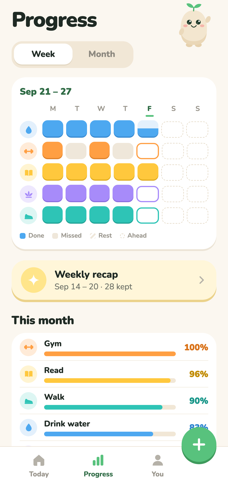 · [bottom](screenshots/71-progress-week-bottom.png) · [month](screenshots/72-progress-month.png) · [12 habits](screenshots/73-progress-week-12-habits.png) · [zero](screenshots/94-progress-zero-habits.png) · [SE](screenshots/113-se-progress.png) · [dark](screenshots/99-dark-progress.png)

| Issue | Sev | Type | Fix |
|---|---|---|---|
| **Weekly habits' off-days are painted "Missed"** (Gym Tue and Thu, [70](screenshots/70-progress-week.png)). | Critical | Real | In `cellKind`, a weekly habit's non-logged past day is `none` (blank) unless the week ended unmet. Show the weekly result as a pill at the row end ("3/4"), as the detail calendar does. |
| **Rows have no names**, only 30pt icons. With custom habits (all sprouts) the grid is unreadable ([73](screenshots/73-progress-week-12-habits.png)). | Major | Real | Name column 96pt (13pt/800, truncating), with the grid cells shrinking to fit. Or name above each row. |
| **Month view is a 16-per-row wrap of 11pt bars** with no day labels, not aligned to weeks ([72](screenshots/72-progress-month.png)). | Major | Real | One row per habit of 30–31 thin bars (4pt wide, 2pt gap) with week separators every 7 days. Or reuse the detail calendar in miniature. "This month" bars below already cover the % view. |
| Today on a habit's rest day shows the "due today" outline instead of hatching (Walk, Friday). | Minor | Real | Check `rest` before `today` in `cellKind`. |
| The "Done" legend swatch uses the first habit's colour (blue), implying blue = done. | Minor | Real | Neutral legend: a grey rounded square with a tick glyph, or "Coloured = done". |
| **Weekly recap card on Progress shows last week on any day** (Friday → "Sep 14 – 20 · 28 kept"). "kept" is a check-in count. | Major | Real | Show the recap entry only Sunday–Wednesday (`recapOffered`). Otherwise show "Recap arrives Sunday" with a locked gift icon. Rename the metric to "28 check-ins". |
| Zero-habit state: the weekday header row renders *under* the empty text with no grid ([94](screenshots/94-progress-zero-habits.png)). | Minor | Real | Hide the header row when `habits.length === 0`. Show Pip `expectant` with "Your week shows up here." |
| No headline insight. The screen is data without a story ("Your best week since June", "Read is your rock"). | Polish | Real | A one-line insight card at the top with a big number (e.g. "43 perfect days"). |
| The waving Pip (78pt) top-right is decoration and overlaps the status area on SE. | Polish | Real | Remove it, or have it react when switching Week/Month (look toward the segment). |

### 2.11 Weekly recap (story)

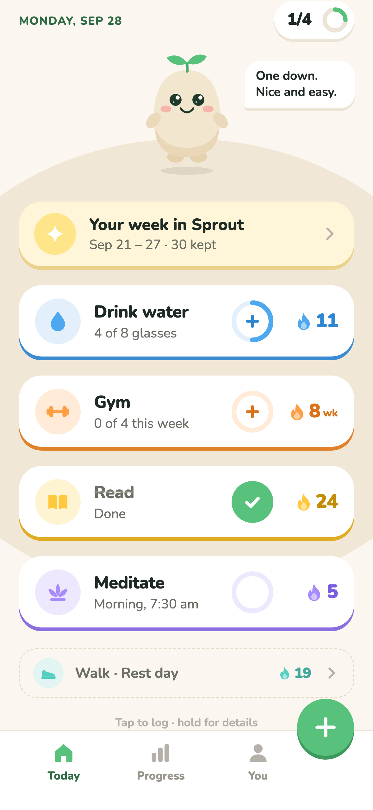 · [count-up](screenshots/101-recap-card-1-countup-frame.png) · [1](screenshots/102-recap-card-1.png) · [2](screenshots/103-recap-card-2.png) · [3](screenshots/104-recap-card-3.png) · [4](screenshots/105-recap-card-4.png) · [final](screenshots/106-recap-card-5.png) · [SE final](screenshots/111-se-recap-final.png)

This is the most polished part of the app: huge numbers, one sentence, a themed ground, props on Pip. Issues:

| Issue | Sev | Type | Fix |
|---|---|---|---|
| **"30 habits kept this week"** with 5 habits ([106](screenshots/106-recap-card-5.png)). | Major | Real | Either "30 check-ins this week" or count habits whose week was kept ("4 of 5 habits kept"). The latter is more honest and on-brand. |
| "See you Monday." shown on Monday (recaps run Sun–Wed). | Minor | Real | "See you next Sunday." or "Go get this week." |
| Card-to-card is a 220ms cross-fade, and every card's Pip does the same 10px hop. There's no build-up to the final card. | Major | Real | Per-card Pip pose entrance (Rive `recapPose` trigger with a `prop` number). Final card: counter rolls 0→30 with a tick sound, then a confetti burst, then Pip plays `proud`. |
| Meditate ("could use a little love") got cut by `slice(0, 4)`, so the recap only ever shows wins once you have 4 good habits. | Minor | Real | Always include at most one "love" card, as card 4. |
| SE: confetti overlaps "See you Monday." and Pip's leaves touch the headline ([111](screenshots/111-se-recap-final.png)). | Minor | Real | Scale Pip to 160pt when height < 700. Keep confetti out of text rects. |
| No hold-to-pause and no tap-left-to-go-back (story conventions). | Minor | Real | Left third goes back, right two-thirds forward, long-press pauses the progress bar. |
| Entry card "Your week in Sprout · Sep 21 – 27 · 30 kept" ([100](screenshots/100-home-monday-recap-entry.png)) sits above today's habits and pushes them down. | Polish | Real | Pip holds a small gift box above the cards (tap to open), which saves about 80pt. |

### 2.12 You / Settings

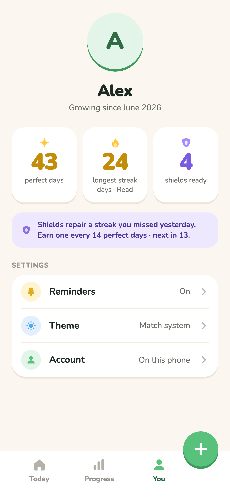 · [account](screenshots/77-you-account-sheet.png) · [zero](screenshots/95-you-zero-habits.png) · [SE](screenshots/114-se-you.png)

| Issue | Sev | Type | Fix |
|---|---|---|---|
| The stat labels "longest streak / days · Read" wrap to 3 lines at 12pt, and the tiles differ in height and rhythm. | Minor | Real | The number with "days" as a suffix ("24d"), and a label on one line ("Read · best"). |
| Theme cycles on tap (System → Light → Dark) with no indication of the options. | Minor | Real | Inline 3-segment control on the row. |
| The Reminders row shows **On** after "Maybe later" (see §2.4). Toggling Off gives no feedback. | Major | Real | Real switch control. When permission is denied, show "Off · Allow in Settings". |
| Shield explainer is 13pt/700 in `#4E3A9E` on lavender tint (fine), but shields have no visual inventory. | Polish | Real | Row of shield icons (filled = ready, outline = next). The next one shows progress "10/14". |
| "Start over" is grey text under Save in the account sheet, destructive and easy to hit. | Minor | Real | Move it to a separate "Danger zone" row at the bottom of You, in coral. |
| **Archived habits are unreachable** (no list, no unarchive). | Major | Real | "Archived (2)" row, then a list with Restore. |
| The FAB covers the Theme chevron on SE ([114](screenshots/114-se-you.png)). | Minor | Real | Hide the FAB on You (it's about habits, not profile) or add bottom padding. |

### 2.13 Dark mode (secondary)

[home](screenshots/97-dark-home.png) · [detail](screenshots/98-dark-detail-read.png) · [progress](screenshots/99-dark-progress.png)

Surprisingly solid. The tints are remixed, and the ledges use accent edges, which look great on `#1D2520`. Issues: "missed" `#26302A` is almost identical to "future" and to the card (Minor, Real): use `#2F3A33` and dashed future cells. The detail header keeps full-saturation accents, which glare against the dark ground (Polish): drop the base by 10% L in dark. The browser pane originally opened in dark mode because the theme follows the system, so the cream first impression depends on the OS setting (FYI).

---

## 3. Cross-cutting issues

### 3.1 Logic bugs (numbers disagree across screens)

| Bug | Where | Evidence | Fix |
|---|---|---|---|
| Weekly habits in the daily badge and perfect day | `logic.ts` `dueOn`/`statusOn` | badge `1/4` incl. Gym, [20](screenshots/20-home-demo-midday.png) | Due only if logged today or `weekAtRisk`. |
| Weekly off-days = "Missed" | `progress.tsx` `cellKind`, detail `cell()` | [70](screenshots/70-progress-week.png), [43](screenshots/43-detail-gym-weekly.png) | Blank for weekly non-days. |
| Recap "habits kept" = check-ins | `recap.ts` `kept +=` | [106](screenshots/106-recap-card-5.png) | Count habits met. |
| Stale recap on Progress Thu–Sat | `progress.tsx` `buildRecap(state, today)` without `recapOffered` | [70](screenshots/70-progress-week.png) | Gate with `recapOffered`. |
| Pause has no dates | `types.ts` `paused?: boolean` | code | `pauses: {from, to?}[]`. Skip paused days/weeks in the streak loops and in `isPerfectDay`. |
| Archive or pause changes the past | `isPerfectDay` uses current habit flags | code | Judge past days by habit state at that time (pause ranges, `archivedAt`). |
| "Maybe later" → reminders On | `onboarding/notify.tsx` | state dump `{"reminders":true,...}` | `false`. |
| Tapping a full counter removes one | `store.tsx` `tap` | code, silent | No-op plus wiggle. |
| Rest-day today shown as due in the grid | `cellKind` order | [70](screenshots/70-progress-week.png) (Walk) | Check rest first. |
| Streak number vanishes | `HabitCard` keyed `entering` | [30](screenshots/30-bug-streak-number-vanishes-after-other-check.png) | Controlled animation (Verify on device). |

### 3.2 Design-system drift

- **The ledge isn't one system.** Accent cards and buttons use 4px; neutral cards, badge, bubble and day toggles 3px; segmented and week cells 2px; rest rows 0. The spec says 4px everywhere. Pick 4px for interactive, 3px for static containers, and document it; drop the 2px variants. The `DailyBadge`, `Bubble`, `DayToggles` and add-sheet options hand-roll their own ledge instead of using `Ledge`/`Card`, so none of them press.
- **Radius sprawl:** 24 (cards), 22 (stat tiles, pick tiles), 20 (stats), 18 (rest rows, options, settings banner), 16 (bubble), 14 (pills, segmented), 11 (calendar). Proposed scale: **24** cards and sheets-inner, **16** controls and rows, **12** cells, **pill = h/2**.
- **Off-grid spacing:** `paddingVertical: 12.5`, `gap: 14`, `gap: 10`, `gap: 6`, `paddingVertical: 9`, `marginTop: 18`, `paddingTop: 26`, `paddingHorizontal: 22`. Normalise to 4/8/12/16/24/32. Side margins are consistently 20 ✅.
- **Hard-coded colours outside tokens:** `#8C887F`, `#D5C8B2`, `#CFC9BE`, `#DCCFB8`, `#9A968D`, `#4D5F74`, `#6D7E93`, `#ECE3D5`, `#6A4FD0`, `#4E3A9E`, `#2F7A48`, `#E3C766`, `#FFE58A`, `#FFF6D9`, `#EBD9BB` (Pip hands in the sheet). Move them into `LIGHT`/`DARK` (`hint`, `dusk*`, `gold*`) so dark mode can't miss them. `#8C887F` in `PerfectDay`'s resting row already ignores dark mode.
- **Typography:** only three sizes carry numbers (20 card streak, 40 You stats, 60 detail). The spec's "streak numbers are huge" isn't true on Home, where 20pt/900 is barely heavier than the 18pt/800 title. Proposed: card streak **24pt/900** with the unit at 12pt; Home badge **20pt/900**; perfect-day count **56pt/900**. Body copy 16/400 in secondary is fine. 12pt/800 captions in `#9A968D`/`#B5B1A8` fail contrast everywhere.
- **One done style:** the spec says a solid green circle with a white tick. It's 44pt on cards, 30pt in the badge and perfect list, 26pt in the detail pill, 26pt in the add-sheet radio (the *same* style used as "selected", which dilutes "done"), and a white badge with a green tick on onboarding tiles. Reserve the green-tick circle for *done* only. Selection states should use an accent ring.

### 3.3 Accessibility

| Pair | Ratio | Needs | Fix |
|---|---|---|---|
| White on `#58C27D` (primary buttons, FAB, done) | **2.23** | 3.0 (18pt bold) / 4.5 | Button face `#2F8A4F` (4.31) with edge `#22703D`, keeping `#58C27D` for rings, fills and ticks on white. Or ink labels on green (6.66), which is less Duolingo but compliant. |
| Tertiary `#B5B1A8` on cream | **2.0** | 4.5 | Hint text to `#736F66` (4.69) or delete hints. Keep `#B5B1A8` only for non-text (chevrons, handles). |
| Label/nav `#9A968D` on white | **2.95** | 4.5 | `#736F66`. |
| White on tangerine / teal / sky headers | 2.0 / 2.2 / 2.6 | 3.0 (60pt) | Ink `#1F2A24` (5.8–7.3). |
| Sunflower ink `#C28E0A` on white (streak digits) | 2.93 | 3.0 (20pt bold) | `#A87A00`. |
| Future calendar `#CFC9BE` on white | 1.65 | (inactive) | `#A8A398`. |

**Tap targets under 44pt:** day toggles 36–38, swatches 34×37, calendar arrows 32, detail back 40, Edit/Pause/Archive about 19pt tall, onboarding back arrow 24 (+12 slop), stepper 32 on Rhythm. (RN `hitSlop` helps on device but not in these web measurements.)

**Colour-only meaning:** Progress cells encode done, missed and rest by colour and pattern only. The legend's "Done" swatch uses one habit's colour. Add a tick glyph to done cells at ≥28pt. The weekly slip crack is a 1px line, invisible to low-vision users, so pair it with the struck number (already there ✅).

**Screen reader:** card labels duplicate "Done" ("Read. Done. Streak 24 days. Done."). The Pick-screen Custom tile has no label beyond its text. `RestRow` is labelled "Walk, Rest day" but hides the streak.

### 3.4 Missing states

- **Loading:** none (the splash waits for fonts and storage). OK on device; web shows a blank white frame for about 1.5s (Web).
- **Error:** AsyncStorage failures are swallowed silently (`.catch(() => {})`), so a failed save is invisible. At minimum, log it and show a Pip "I couldn’t save that" toast.
- **First check ever:** no special moment ("Your first streak starts today 🔥"). This is the moment that matters most for retention.
- **Streak milestones** (3, 7, 30, 100): nothing.
- **Undo snackbar:** none.
- **Archived list / unarchive:** none.
- **Backfill yesterday:** none.
- **Notifications UI:** web can't schedule (expected, `remindersSupported = false`). But turning reminders on shows copy about **"Expo Go on Android"** on every unsupported platform, including web and iOS simulator builds. Make the message platform-aware.

### 3.5 Copy & voice

Mostly excellent: warm, specific, short. Examples to keep: "3 is plenty.", "22 days is worth saving.", "Two minutes a day is plenty." Fix:
- Bubble lines don't scale past 5 habits ("One down. Nice and easy." at 1/11). Add count-aware lines ("11 is a lot — pick your top 3 for today?").
- "Tap to log · hold for details" is an instruction, not a voice. Delete it once the UI is self-explanatory.
- "No shields yet" → "No shields left".
- "Week done · back Monday" is great. Mirror that tone in "Rest day · back tomorrow" (already ✅).
- Onboarding: "I already have an account" → sample garden (see §2.1).

---

## 4. Polish plan (impact ÷ effort, best first)

| # | Change | Impact | Effort |
|---|---|---|---|
| 1 | Fix weekly-habit due logic and Progress/detail "missed" rendering | Very high | S |
| 2 | Delay the Perfect Day swap about 1.1s so the final check completes; persist `celebrated` so it plays once | Very high | S |
| 3 | New done style: tint-filled card, ink title, "Done · 8:05" sub, no strikethrough | High | S |
| 4 | Contrast tokens: button face `#2F8A4F`, hint `#736F66`, ink on accent headers | High | S |
| 5 | Bigger check-off beat: 28-piece gravity confetti, card boop, +1 chip, badge spring | High | S–M |
| 6 | Undo snackbar; stop whole-card untoggle; a full counter no longer decrements | High | S |
| 7 | Default colour/icon rotation for new habits; 40-char names; icon picker grid | Medium-high | S–M |
| 8 | Notify: ScrollView for SE; "Maybe later" → reminders false; add header/back | Medium | S |
| 9 | Rhythm: footer with gradient behind "Plant it"; real time picker | Medium | S |
| 10 | Pip droopy redesign (sad, not mad); evening → expectant; bubble width 168 | High | S (SVG) / M (Rive) |
| 11 | Recap: "4 of 5 habits kept", gate by day, story tap-back/hold | Medium | S |
| 12 | Tappable calendar backfill (7 days) and "I did it" on the slip sheet | High (trust) | M |
| 13 | Pause ranges in the model; paused visuals on detail | Medium | M |
| 14 | Progress: names column, month view rebuilt as a strip | Medium | M |
| 15 | Normalise ledge, radii and spacing tokens; migrate hand-rolled ledges to `Ledge`/`Card` | Medium (consistency) | M |
| 16 | Pip Rive rig with `dayProgress` (see §5) | Very high (brand) | L |
| 17 | Flame ignite + streak roll (Rive) and shield repair moment | High | M |
| 18 | Archived list, danger zone, theme segmented control | Low-medium | S |

---

## 5. Rive animation plan

**Where Rive earns its place:** anything character-driven or layered with state (Pip, the flame, the shield) where a designer will iterate on timing without code changes. **Where it doesn't:** geometric UI (rings, check ticks, badges, progress bars, list reflow). Reanimated plus SVG already does these well, they must be pixel-exact with tokens, and Rive would add runtime cost on every card. Note that `rive-react-native` is a native module, so you need a dev build (not Expo Go); Expo web uses `@rive-app/react-canvas`. Keep a static SVG fallback (the existing `Pip.tsx`) for widgets, reduced motion, and while the `.riv` loads.

### 5.1 Opportunity table

| # | Location | Trigger | What it looks like | State machine inputs | Tool | Priority | Effort |
|---|---|---|---|---|---|---|---|
| 1 | **Pip, Home hill** (`(tabs)/index.tsx`) | App open, every log, time of day, slips | Idle breathe, blinks, leaf sway; posture rises with day progress; reacts to each check; taps get a giggle | `dayProgress` 0–1, `mood` 0–7, `night` bool, `slip` bool, triggers `tap` `celebrate` `perfect` `slip` `shieldSaved` `wave`, `lookX` −1–1 | **Rive** | **Must** | L |
| 2 | **Check-off burst**, HabitCard control | `tap()` returns completed | Tick draw, 1.03 card boop, 28-piece gravity confetti in accent/green/gold | none | **Reanimated** (or Skia particles) | **Must** | S |
| 3 | **Flame ignite + streak +1**, HabitCard streak column | Streak increments | Flame flares and licks up, embers pop, number rolls up, "+1" chip floats | `lit` bool, `streakTier` 0–3, trigger `ignite` `crack` | **Rive** flame, number in RN | **Must** | M |
| 4 | **Perfect day sequence**, `PerfectDay` | Last due habit done | Badge turns gold, Pip hop and cheer, gold wash wipes up from the hill, confetti rain, "Perfect day" title | Pip `perfect` trigger; confetti artboard `play` | **Rive** (Pip + confetti) + Reanimated (wash, title) | **Must** | M |
| 5 | **Shield repair**, `SlipSheet` | "Use a shield" | Cracked flame flickers, shield drops and bounces, crack stitches with light, flame re-ignites, strike wipes off the number | `cracked` bool, trigger `repair` | **Rive** | **Must** | M |
| 6 | Slip sheet Pip | Sheet opens | Pip peeks, sad (not mad), holds the cracked flame, looks at the buttons | Pip `slip` trigger, `lookX` | Rive (same rig) | Should | S (after #1) |
| 7 | Daily badge ring | Each log | Ring springs forward; at full it morphs to the gold check with a sparkle | none | **Reanimated** | Should | S |
| 8 | Weekly/counter ring fill | Tap on a counter | Arc advances with overshoot; the "+" pulses; the last segment sparkles | none | **Reanimated** (exists; add sparkle) | Should | S |
| 9 | Recap story Pip poses | Card change | Pip enters with a per-habit prop (book flip, dumbbell curl, walk cycle), final card trophy lift | `prop` 0–6, trigger `pose`, `proud` | Rive (same rig) | Should | M |
| 10 | Recap number count-up | Card enters | Already a count-up; add a scale punch at the end and ticks | none | **Reanimated** | Should | S |
| 11 | Onboarding welcome | First launch | Seed drops onto the hill, sprouts two leaves, blinks awake, waves | Pip `wave`; intro artboard `play` | Rive | Should | M |
| 12 | Onboarding pick tiles | Tile selected | Pip looks at the tile and nods; at 5+ picks Pip wipes their brow ("that’s a lot") | Pip `lookX`, trigger `nod`, `worry` | Rive (rig) | Nice | S |
| 13 | Empty states (zero habits, all-rest) | Screen shown | Pip pats soil and plants a seed; on a rest day Pip naps in a hammock | Pip `mood` = sleepy + `prop` hammock | Rive (rig + prop) | Nice | S–M |
| 14 | Streak milestones (3/7/30/100) | Streak crosses a tier | Flame evolves (bigger, blue core at 30, crown at 100) with a full-screen moment | flame `streakTier`, trigger `levelUp` | Rive | Should | M |
| 15 | Tab icons | Tab change | Home leaf wiggle, chart bars rise, person waves | none | **Reanimated** / Lottie (not worth a Rive runtime per icon) | Nice | S |
| 16 | Splash / loading | Cold start | Seed pulses, leaves unfurl as the store hydrates | `progress` 0–1 | Rive (tiny file) or static | Nice | S |
| 17 | Add sheet Pip | Typing a name | Pip's eyes follow the caret, nods when an icon is guessed, claps on "Add habit" | Pip `lookX`, triggers `nod` `clap` | Rive (rig) | Nice | S |
| 18 | Notify step bell | Screen enters | Pip rings the bell with its arm only (not the whole body), with sound lines | Pip `prop` bell, trigger `ring` | Rive (rig) | Nice | S |
| 19 | Evening dusk | After 8 pm | Fireflies drift across the hill; Pip yawns occasionally | `night` bool | Rive (Pip) + Reanimated (fireflies) | Nice | S |

### 5.2 Must-have specs

#### M1. Pip master rig: `pip.riv`, artboard `Pip`, state machine `Pip`

**Inputs**

| Input | Type | Source in the app |
|---|---|---|
| `dayProgress` | Number 0–1 | `doneN / total` in `Today` (0 when `total === 0`) |
| `mood` | Number (enum) | 0 expectant, 1 happy, 2 cheering, 3 proud, 4 sleepy, 5 droopy, 6 relieved, 7 waving. Derived exactly as today's `mood` switch. |
| `night` | Boolean | `hour >= 20` (drives heavier blink, yawns) |
| `slip` | Boolean | `slip != null` |
| `prop` | Number | 0 none, 1 book, 2 dumbbells, 3 meditate, 4 sneakers, 5 trophy, 6 bell, 7 hammock |
| `lookX` | Number −1–1 | Target card x or touch x, normalised |
| `tap` | Trigger | Pressable over Pip |
| `celebrate` | Trigger | `onTap` → `completed === true` |
| `perfect` | Trigger | Transition into perfect day (once per day) |
| `slipIn` | Trigger | Slip sheet opens |
| `shieldSaved` | Trigger | `rescue()` |
| `wave` | Trigger | Welcome, Progress entrance |

**Layers** (all run in parallel; Rive supports multiple layers per state machine)
1. **Base / Posture.** A 1D blend state on `dayProgress`: 0 = body `by: +2`, leaves at `tilt 10°`, arms down, idle bounce amplitude 1px. 0.5 = body 0, leaves up, arms relaxed out 20°, amplitude 2px. 1 = body −6, leaves perky ±8°, arms out 40°, amplitude 3px with a tiny squash on landing. Blend with a 400ms smoothing so each log visibly "lifts" Pip.
2. **Mood face.** States keyed by `mood` (any-state transitions on `mood == n`, 200ms mix). Each state sets eyes, mouth and blush intensity. **Droopy is redesigned:** outer lid corners *down* (sad), mouth a small wobble, blush 60%, leaves wilt to 35° max. Never inward brows.
3. **Blink & look.** A blink loop (random 2.5–5s via two timeline variants) plus a `lookX` blend that moves pupils ±6 units and turns the head 3°. At `night` the blink runs slower, 1.2× longer, and an 8s yawn one-shot plays.
4. **One-shots** (triggers, interrupting then returning to Posture):
   - `tap` (600ms): squash to 0.92/1.06 at 80ms, stretch at 180ms, leaves spin ±25° and settle with overshoot, a giggle mouth and eyes-happy for 400ms. Every third tap, a heart pops.
   - `celebrate` (900ms): anticipation dip −4 (0–100ms), jump −24 with arms up (100–380ms), leaves flare ±20°, land with squash (380–520ms), arms pump twice (520–900ms).
   - `perfect` (1600ms): two hops, a 360° leaf twirl, and a final pose of arms up with a star-eye flash (120ms), holding cheering, then crossfading to `proud` at 2.5s.
   - `slipIn` (700ms): slow sag, leaves wilt, eyes look at the flame. Then hold on droopy with the soft lids.
   - `shieldSaved` (1200ms): eyes widen, jump, catch pose, relieved exhale (body scaleY 0.97→1), eyes-happy.
   - `wave` (1000ms): right arm waves ×3 from the shoulder bone.
5. **Props.** A `prop` number toggles the solo'd prop groups. Each prop overrides only the arm bones (via a layer blend of 1.0 on the arm bones).

**App wiring:** a `<PipRive>` wrapper with the same props as today's `Pip` (`mood`, `prop`, `size`) plus `dayProgress` and an imperative `fire('celebrate')`. Fall back to the SVG `Pip` when `AccessibilityInfo.isReduceMotionEnabled()` or on widgets.

#### M2. Check-off burst: Reanimated, not Rive

Beats: **0ms** the press releases (ledge back) and the card scales 1→1.03→1 over 220ms with a spring. **80ms** the tick draws (existing `DoneCheck`, 320ms). **120ms** 28 pieces fire from the control centre: 6 shapes (rounded rect 6×11, circle 8, squiggle), colours `[accent, #58C27D, #FFC83D, accent-tint]`, speeds 280–520px/s, 360° with a bias upward, gravity 900px/s², rotation 180–540°, and a fade in the last 30% over 1100ms. **200ms** trigger the flame (M3). **250ms** trigger `Pip.celebrate`. **600ms** the badge ring springs. Haptic `success` at 80ms (native). This is geometric and token-coloured, so it doesn't justify Rive.

#### M3. Flame: `fx.riv`, artboard `Flame`, state machine `Flame`

- **Inputs:** `lit` Boolean (streak > 0), `tier` Number 0–3 (0: 1–6, 1: 7–29, 2: 30–99, 3: 100+), `ignite` Trigger, `crack` Trigger, `repair` Trigger, `accent` via runtime colour (Rive data binding or 8 pre-coloured variants as nested artboards).
- **States:** `Out` (grey outline) → `Idle` (a 1.8s flicker loop, 3 path-morph keys) → `Ignite` one-shot (0–120ms the flame compresses 0.8; 120–300ms it shoots to 1.35 with 3 embers popping up 18–30px; 300–600ms it settles with overshoot to 1.0). `Cracked` (desaturated, with a crack path drawn in 250ms and a slow sputter loop). `Repair` (see M5). Tier changes crossfade the flame shape: taller, a second inner tongue at tier 1, a blue core at tier 2, a crown ember at tier 3.
- **Numbers stay in React Native** so they use Nunito and tokens, with a controlled roll (fixing the vanishing bug). The +1 chip floats from the flame, rising 16pt and fading over 700ms.
- **Data:** `streak`, `prevStreak`, `unit`, `h.color`.
- **Size:** keep the flame artboard under 64×64 units and use it at 22pt on cards. One instance per visible card is fine with Rive's renderer. If more than 10 cards are visible, pause offscreen instances (`autoplay={false}` plus play on `onViewableItemsChanged`).

#### M4. Perfect day sequence (Rive + Reanimated)

Timeline from the moment the last habit completes:
1. **0–900ms:** M2 check-off on the last card, plus M3 ignite.
2. **700ms:** the badge ring completes, morphs to a gold check (Reanimated), and a gold sparkle pops.
3. **1000ms:** `Pip.perfect` fires. The hill tint crossfades to `#FBDD8A` (300ms).
4. **1100–1500ms:** the gold wash wipes up from the hill line (Reanimated `clipPath`/`translateY` mask). The cards collapse into the compact done list with `LinearTransition` (380ms, spring).
5. **1300ms:** the `Confetti` artboard in `fx.riv` plays a 1.8s rain: 40 pieces with gravity, fired as two bursts at 1300 and 1600ms.
6. **1600ms:** "Perfect day" title, scale 0.9→1 plus fade (spring, 400ms). Then the count number rolls up.
7. **2500ms:** Pip crossfades to `proud` (trophy).

**Persistence:** add `celebrated: DayKey[]`. If today is already celebrated, render the final frame with no animation.

**Inputs:** Pip `perfect`. `Confetti` artboard `play` trigger, plus a `palette` number to pick from 3 colour sets.

#### M5. Shield repair: `fx.riv`, artboard `ShieldRepair`

- **Inputs:** `accent` (variant), `repair` Trigger, `cracked` Boolean.
- **Beats:**
  - 0ms: the cracked flame (from M3's `Cracked`) sputters.
  - 150ms: the shield falls from −80 with a 12° spin.
  - 420ms: it lands on the flame's base with squash 1.2/0.85, and a lavender ring shockwave expands to 1.6× and fades over 300ms.
  - 500–900ms: the crack path "stitches" (trim path from the ends to the centre) with a white glow.
  - 900ms: the flame re-ignites (M3 `Ignite`, tinted to the accent).
  - 1000ms: the RN number's strike line wipes off left-to-right over 250ms.
  - 1200ms: the "Streak saved" title enters.
  - Simultaneously, Pip plays `shieldSaved` above the sheet edge. Success haptic at 420ms.
- **Why Rive:** trim-path stitching, the shockwave and the flame state reuse are a character moment designers will tune. It's also the "positive moment" the spec demands.

### 5.3 File structure & rig recommendations

- **`pip.riv`**: one artboard, **one state machine with layers** (Posture, Face, Blink/Look, One-shots, Props). One state machine keeps inputs in one place and lets triggers interrupt cleanly. Resist per-mood files, because transitions between them are where the charm lives. Add secondary artboards in the same file only for the Welcome intro (`PipIntro`) and the small widget pose if needed.
- **`fx.riv`**: `Flame`, `ShieldRepair`, `Confetti` artboards, each with its own tiny state machine. These are loaded on many screens, so keep this file separate from Pip.
- **`splash.riv`** (optional, Nice-to-have): tiny, loaded before the store.
- **Keep files small:**
  - Vectors only, no raster.
  - No embedded fonts: all numbers and text in React Native.
  - Solid fills, which suits the flat style; avoid gradients and feathering except one glow.
  - Prefer bone rotations and transforms over path-vertex keyframes, and use vertex animation only for the mouth and flame tongues.
  - Share one leaf shape instanced twice (mirrored).
  - Keep keyframe counts low: ease curves, not dense keys.
  - Colour variants: use Rive data binding / runtime colour where the runtime supports it; otherwise use one solo'd colour group per accent, not duplicated artboards.
  - Targets: `pip.riv` ≤ 80 KB, `fx.riv` ≤ 40 KB.
- **Pip rig split** (mirrors `PipPart` in `Pip.tsx`, same 200×240 artboard and stem pivot at (100, 46)):
  - `root` → `shadow` (scales with jump height)
  - `body` (shell + bottom shade path; a squash/stretch bone at the base, pivot (100, 210))
  - `head` group inside body for the `lookX` turn: `eyes` (L/R: pupil, highlight and lid shapes; lids as separate shapes over the eye so open, half, closed, happy and sad are lid transforms, not swapped art), `blush` (L/R, opacity driven), `mouth` (one path with vertex states: smile, grin, open, tiny, wobble), `zz` (night only)
  - `stem` bone → `leafL`, `leafR` (pivot at the stem tip; a constraint keeps the leaves attached to the top of the head through every squash, per the spec's "leaves always stay on top")
  - `armL`, `armR` (shoulder bone plus hand bone; hands are circles `#EBD9BB`)
  - `feet` (L/R ellipses; the `walk` and `cross` leg variants as solo groups)
  - `props` (solo group: book, dumbbells, meditate cushion, sneakers, trophy, bell, hammock, gift). Each prop has its own hand-target so arm bones can IK to it.
  - This split lets every mood be a combination of lid transform, mouth vertex state, leaf rotation, arm bone pose and body offset: one rig, zero redraws, exactly how the SVG is already built.

---

## 6. Suggested build order (rest of the weekend)

**Saturday morning: correctness (≈3h)**
1. `dueOn`/`statusOn` weekly fix plus Progress/detail weekly cells (Top 1).
2. Recap `kept`, gate the recap by `recapOffered`, and "See you next Sunday".
3. `notify.tsx`: `reminders: false` on "Maybe later", ScrollView for SE, header with back.
4. A full counter doesn't decrement; whole-card untoggle is replaced by check-only plus an undo snackbar.
5. Streak-number roll without the keyed `entering` (then verify on device).

**Saturday afternoon: the reward loop, without Rive (≈4h)**
6. Delay the Perfect Day swap (~1.1s) and persist `celebrated`.
7. New done card style (tint fill, no strikethrough) everywhere.
8. Bigger confetti burst plus card boop plus +1 chip plus badge spring (M2).
9. Contrast tokens (button face, hint, header ink) and 44pt hit areas.
10. Default colour/icon rotation, 40-char names, footer behind "Plant it".

**Sunday morning: Pip in Rive (≈4–5h)**
11. Rig `pip.riv` (parts per §5.3) with Posture + Face + Blink layers and `tap`/`celebrate`.
12. Swap Home's `Pip` for `<PipRive>` with `dayProgress`; keep the SVG fallback. Test on a device (dev build).

**Sunday afternoon: signature moments (≈3–4h)**
13. `fx.riv` flame (`Idle`/`Ignite`/`Cracked`) on cards.
14. Shield repair (M5) and slip-sheet Pip (#6).
15. Perfect day sequence (M4) using the Pip `perfect` trigger and the confetti artboard.
16. If time remains: tappable 7-day backfill on the detail calendar and pause ranges.

Leave the Progress month rebuild, the recap story gestures, milestones and the Nice-to-have Rive items for next weekend.
